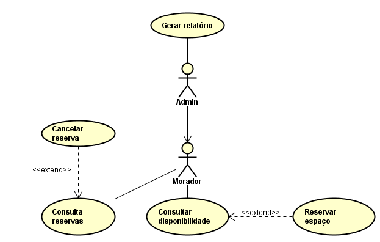
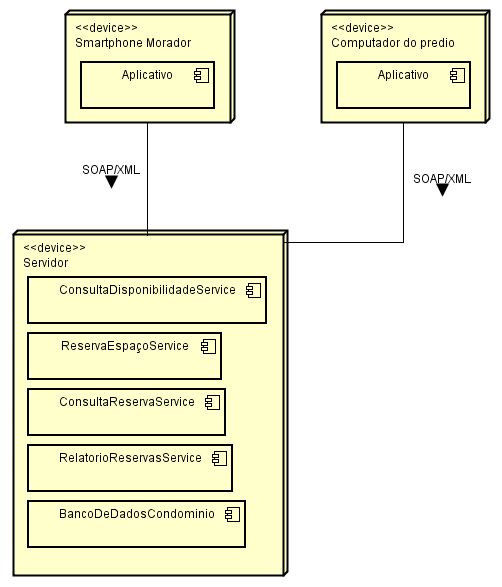
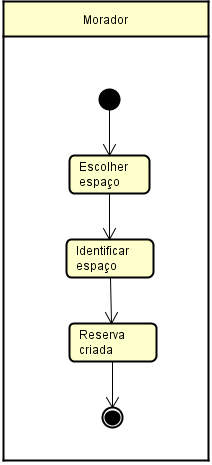
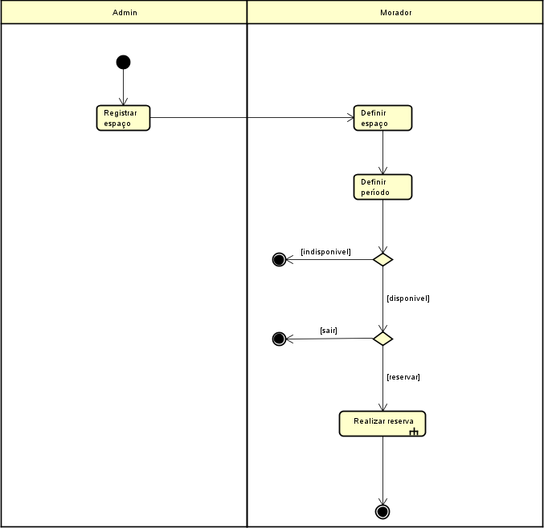
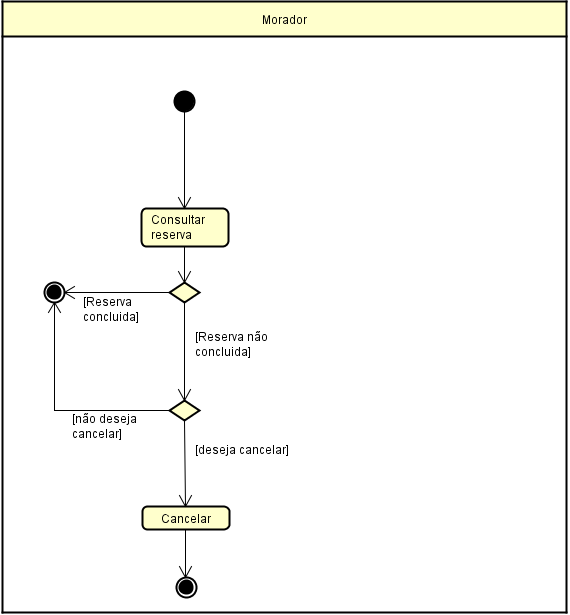
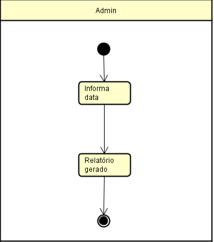
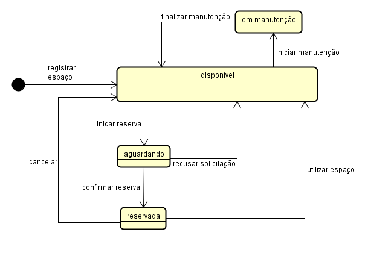
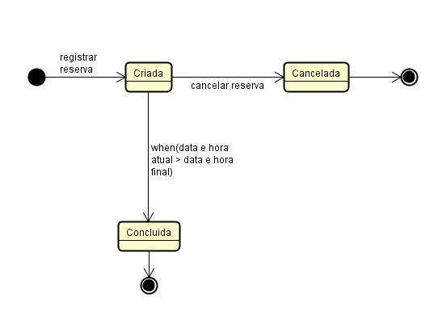

# Architecture Document

## 1. System Context

The system streamlines the space reservation process in residential apartment complexes, as well as facilitating the management of available spaces and reservations.

### Main users

- **Resident**: Browses available spaces, makes reservations, and views reservation history;
- **Administration**: Manages registered users, registered spaces, and reservations made on the platform.

### Main features

- Check availability of registered spaces;
- Reserve an available space;
- View reservations and their respective statuses, as well as cancel confirmed reservations;
- **(Administration)** Generate reservation reports based on time periods.

## 2. Use Cases

## 3. Deployment Architecture and Services

The internal architecture of the application consists of the following layers:

- Mobile web application interface used by residents and administrators;
- Desktop web application interface used by doormen;
- Communication between layers via SOAP/XML;
- Server-side services;
- Relational database.

### Main Services

The main use cases of the application are implemented as services on the server.

| Service                          | Responsibility               |
| ----------------------------------| ------------------------------|
| `ConsultaDisponibilidadeService` | Check space availability     |
| `ReservaEspacoService`           | Create reservations          |
| `ConsultaReservaService`         | Retrieve reservations        |
| `RelatorioReservasService`       | Generate reports             |

## 4. Main User Flows

### 4.1 Create a reservation

To create a reservation in the system, the user must specify the space they wish to reserve, start date and time, and end date and time.

### 4.2 Check Availability and Reserve

Before creating a reservation, the user must first verify whether the desired space is available. Spaces that already have a reservation for the chosen time period or that are closed for maintenance cannot be reserved.

### 4.3 Cancel a reservation

If the user decides to cancel a confirmed reservation, they can do so through the system. A reservation can only be cancelled if it has not yet been completed (i.e., the scheduled time period has not yet ended).

### 4.4 Generate a report

The administrator can generate a report of reservations registered during a time period, which must be specified in the form.

## 5. State Management

The system has two state machines: Space and Reservation.

### 5.1 Space States

A Space can assume any of the following states:

- **Available**: The space is open and can receive reservations;
- **Reserved**: There is an active reservation for this space at the moment;
- **Under maintenance**: The space has been closed for maintenance and cannot receive reservations.

> NOTE: The system implementation does not include the "Waiting" state for a space. This will be considered for future versions.

### 5.2 Reservation States

A reservation can assume any of the following states:

- **Created**: Initial state, assumed immediately after its creation;
- **Cancelled**: The reservation has been cancelled;
- **Completed**: The reservation assumes this state automatically after the end date and time has passed, via the `ReservaConclusaoScheduler` class.

## 6. Architectural Decisions

### Service-Oriented Architecture

The server layer of this system was developed following the Service-Oriented Architecture (SOA) style, in which the server exposes a series of services that provide the system's features.

This architectural style was chosen for the system's server layer because the business capabilities are operations with different purposes and no operational dependency on each other (e.g.: "check the availability of a space" and "generate a reservations report"), making these capabilities easily mappable to discrete services. Additionally, services are reusable, which enables the same server to serve both client applications the system has.

### Communication Protocol

The communication protocol used by this application is SOAP (Simple Object Access Protocol), which uses XML files sent via HTTP to make calls to services defined using WSDL (Web Service Description Language).

This protocol was chosen due to the formal contract established for each service via WSDL. With these contracts, each service has explicit definitions of its inputs, outputs, and access points, ensuring interoperability between client applications and the Service-Oriented server.

### Separate Web and Mobile Clients

The system has two web graphical user interfaces: one for mobile devices and one for desktop devices. The decision to create two separate client applications is tied to the different interaction needs of each user type.

The mobile interface was built to provide a fast and streamlined experience for residents to make reservations at any time and for administrators to manage reservations and available spaces without needing a dedicated workstation. On the other hand, the desktop interface takes into account the fact that the doorman spends most of their time at a fixed workstation and the need to monitor reservations in fixed time periods (day, week, etc.).

### State Pattern for Spaces and Reservations

As mentioned earlier in this document, the system has two domain entities with state machines: Space and Reservation. To facilitate state management for these entities, the State design pattern was used.

The State pattern allows an object to assume different behaviors based on the state it is currently in, eliminating complex conditional logic within the context class to handle each of its possible states.

### Repository Layer

Database call methods for each domain entity are handled by Repository classes. These classes act as intermediaries so that service classes can retrieve information from persistent storage. They encapsulate persistence logic, allowing the system to abstract this implementation and making it straightforward to modify.

A Proxy was used in the Repository layer (`EspacoRepositoryProxy` and `ReservaRepositoryProxy`) to intercept calls before delegating them to the real database implementation and to log all accesses made to the database.

### PostgreSQL for Database Management

The relational database system PostgreSQL was chosen to manage the database. This decision was driven by the strong relationships between domain entities (reservation ↔ space, user ↔ reservation, etc.) and the development team's familiarity with PostgreSQL.

### Database Migrations

The Flyway tool was used to manage schema changes in the database, preventing schema divergence across different environments. This is achieved by versioning schema changes as sequential "migration" files, each representing a distinct version of the schema.

## 7. Diagram-to-Implementation Mapping

| Architecture Element  | Implementation                          |
| -----------------------| -----------------------------------------|
| SOAP Endpoints        | `api/.../endpoint`                      |
| SOAP Configuration    | `api/.../config`                        |
| WSDL Contracts        | `api/src/main/resources/wsdl`           |
| Business Services     | `api/.../service`                       |
| Reservation Scheduler | `api/.../scheduler`                     |
| Space States          | `api/.../state/espaco`                  |
| Reservation States    | `api/.../state/reserva`                 |
| Persistence           | `api/.../repository`                    |
| Persistence Proxy     | `api/.../repository` (classes `*Proxy`) |
| DB Schema             | `api/src/main/resources/db/migration`   |

## 8. Constraints and Assumptions

- A reservation applies to only one space and one time period;
- Reservations that have already been completed cannot be cancelled;
- Availability depends on the Space state and existing reservations;
- Web and Mobile clients consume the same SOAP services.
